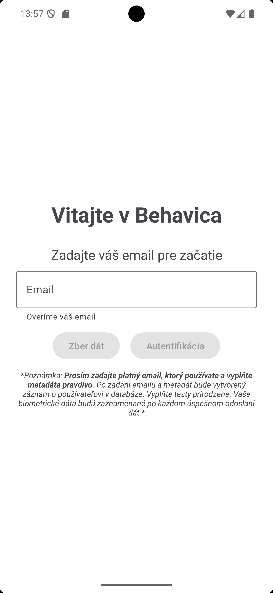
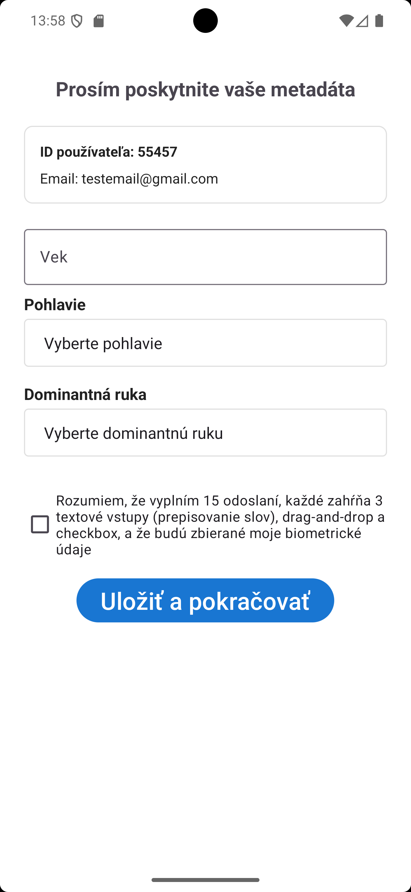
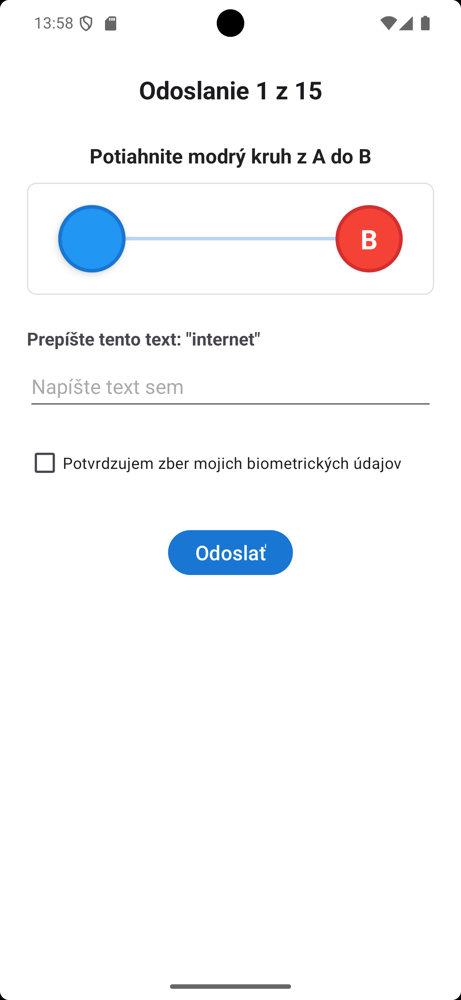
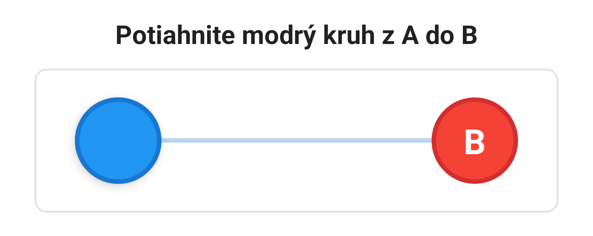

# Behavica — Behavioral Biometrics Authentication

Behavica is an Android app that authenticates users by *how they behave*, not by
what they know (PIN, password) or how they look (fingerprint, face). It records
the way a person touches the screen, types on the keyboard, and holds the phone,
and uses those patterns to tell a legitimate user apart from an attacker.

This repository contains the full system built for a bachelor's thesis: the data
collection app, the cloud backend, and the machine-learning authenticator.

## How it works

1. **Data collection** — The user completes 15 repetitions of three short tasks:
   a drag & drop test, retyping three words (*internet, wifi, laptop*), and a
   checkbox + submit. While they interact, the app records touch events,
   keystroke timing, and accelerometer/gyroscope data.
2. **Storage** — Each repetition is uploaded to Firebase Firestore.
3. **Training** — A Random Forest classifier is trained on 64 features extracted
   from the collected data (touch, keystroke, sensor, and aggregate metrics).
4. **Authentication** — A Firebase Cloud Function loads the trained model and
   decides, in real time, whether a new attempt belongs to the claimed user.

A device-independent variant of the model (44 features, hardware-specific
features removed) is used in production because it resists attacks where a
stranger tries to authenticate on the victim's own phone.

## Screenshots

| Main screen | Metadata | Tasks | Drag & drop test |
|:---:|:---:|:---:|:---:|
|  |  |  |  |

## Project structure

| Path | What it is |
|---|---|
| `app/` | Native Android app (Kotlin) — data collection + authentication UI |
| `functions/` | Firebase Cloud Function (Python) — serves the authentication model |
| `RandomForestAuth/` | Python: feature extraction, training, evaluation, export |

> The collected dataset, the trained model, and the thesis text are **not part
> of this repository** — they contain personal biometric data and are excluded
> for privacy reasons. The code here documents how the system is built and works.

## Results (36 users)

- **5-Fold cross-validation:** EER 0.63 %, identification accuracy 99.40 %
  (full 64-feature model)
- **Production model (device-independent, 44 features):** EER 4.86 %
- **Production verification** with a real time gap: 26 of 31 users (83.9 %)
  verified within three attempts
- A controlled cross-device experiment confirmed the device-independent variant
  rejects 100 % of attacks made from the victim's phone

## Tech stack

Kotlin · Android SDK · Firebase (Auth, Firestore, Cloud Functions) ·
Python · scikit-learn (Random Forest)
